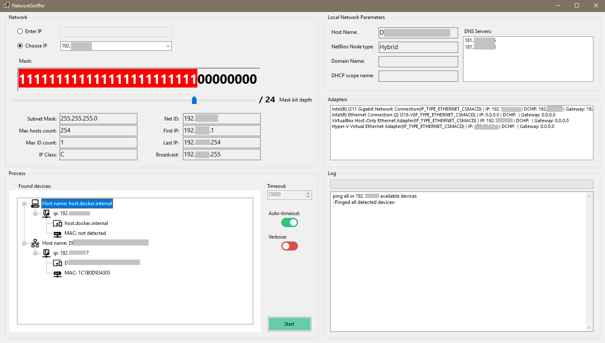

# MyNetworkSniffer

based on <https://www.codeproject.com/Articles/5344688/Network-Sniffer-and-Analyzer-Program-Part-1#_articleTop>

I took the program, refactored the code and added a few new features. This was an excercise in Interop and Networking for me.

